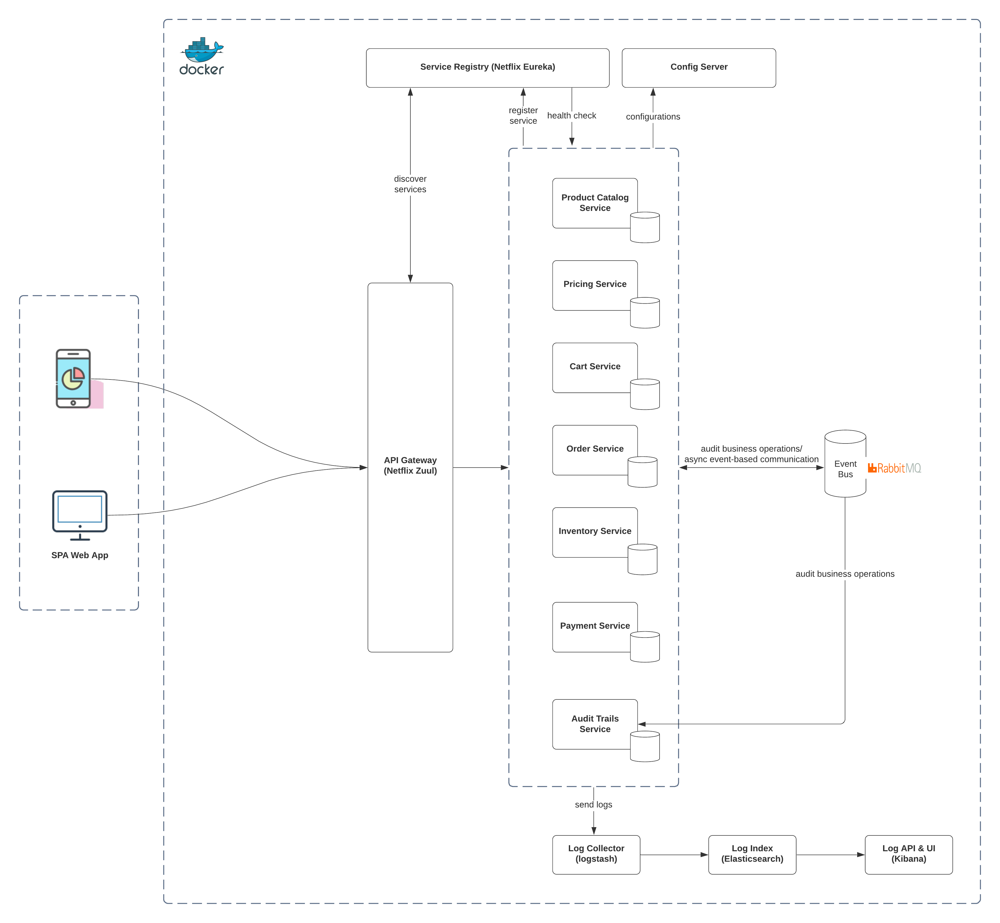

# Sample eCommerce Demo Using Microservices

### Context
This sample eCommerce application demonstrates how to build an application using microservices architecture to fulfill some of basic requirements. 
All the services are using Spring Boot and Spring Cloud with the de factor Netflix OSS. However, nothing should stop us from using a polyglot microservices model.

### High level application architecture (for reference)


#### Hosting environment
All microservices have been deployed within Docker hosts so it can be run in any infrastructure provider. 

#### Communication between microservices
All microservices are deployed within Docker hosts.
1. Http synchronous communication for queries as well as for simple transactions 
2. Asynchronous event-based communication: for complex transactions where microservices should be decoupled. Some examples:
- audit logs for business operations such as view product, add to cart, etc...
- submit shopping cart business process which have 5 main steps - they should be executed in sequence:
    - validate shipping address
    - reserve payment
    - allocate inventory
    - place order
    - notify customer
#### Performance consideration
1. Product Catalog, Price, Recommendations are good candidates to use Cache Aside pattern to improve performance
2. Supposing the PWA frond-end will try to load product basic information first then loading other info such as prices/recommendations asynchronously 

#### Database consideration
1. To support the unstructured and variant product attributes such as color, size, tagging and so on, NoSQL (MongoDB in this demo) is used.
2. The pattern Temporal Table is used to track the history of price's changes. Any changes to the price will be tracked automatically at DB level. 

### Implementation
#### Scope
For demonstration purpose, only three microservices have been implemented. 
* **Product Catalog Microservice**
* **Pricing Microservice**
* **Audit Trail Microservice**

Also, two Spring Cloud patterns are being applied in this demo:
- Service Registry with Netflix Eureka
- Service Gateway with Netflix Zuul

#### Important notes
- No unit tests so far - will be added once I have more time
- Product Catalog and Audit Trail are sharing the same DB (MongoDB). This is for demonstration purpose only in order to keep it simple. No execuse if we use this pattern in practices.
- The application uses single-parent repo where each microservice is as a sub-module. You can run each microservice individually.

#### Prerequisites
* **_JDK 8_**
* **_Docker Desktop (for Windows)_**
* **_Gradle [Optional]_**

#### Installation
##### Clone Repository
Clone respository source code by executing following instruction to any folder on your machine,
```
git clone https://github.com/kytruong/ecommerce-demo.git
cd ecommerce-demo
```
##### Building Application
###### 1. Building Microservices
```
gradlew build
```
This command might take a while for first time. It will build and package all microservices into JAR files.
###### 2. Dockerizing
You can now build Docker images and run containers Docker host on your machine.
```
cd ecommerce-demo
docker-compose build --no-cache
docker-compose up
```
Above command starts all microsevices containers specified in 'docker-compose.yml' file.

Once tested, you can bring the docker containers down:
```
docker-compose down --remove-orphans
```

### API

**All APIs are setup in Postman collection **

#### Product Catalog Microservice
##### Overview
Product Catalog Microservice manages products. It uses MongoDB as persistance store for product information.

##### REST API
Method | URI | Description | Parameters | Request JSON | Response JSON
--- | --- | --- | --- | --- | ---
`GET` | */products* | List of products | None | _[TODO]_ |
`GET` | */products/{id}* | Get product by id | None | _[TODO]_ |
`POST` | */products* | Adds new product | _[TODO]_ | _[TODO]_ |
`PUT` | */products/{id}* | Updates existing product | _[TODO]_ | _[TODO]_ |

#### Pricing Microservice
##### Overview
Provide ability to manage the prices independently from Product Catalog. In reality, pricing model is one of the most complex operation in a eCommerce site.

#### REST API
Method | URI | Description | Parameters | Request JSON | Response JSON
--- | --- | --- | --- | --- | ---
`GET` | */prices* | Get all prices | None | _[TODO]_ |
`GET` | */prices/productIds* | Get prices by product Ids | _[TODO]_ | _[TODO]_ |
`POST` | */prices* | Add a new pricing model | _[TODO]_ | _[TODO]_ |
`PUT` | */prices* | Update a pricing model | _[TODO]_ | _[TODO]_ |

#### Audit Trail Microservice
##### Overview
Provide ability to save audit logs to DB and query those log on demand.

#### REST API
Method | URI | Description | Parameters | Request JSON | Response JSON
--- | --- | --- | --- | --- | ---
`GET` | */audittrails* | Get all audit logs | None | _[TODO]_ |
